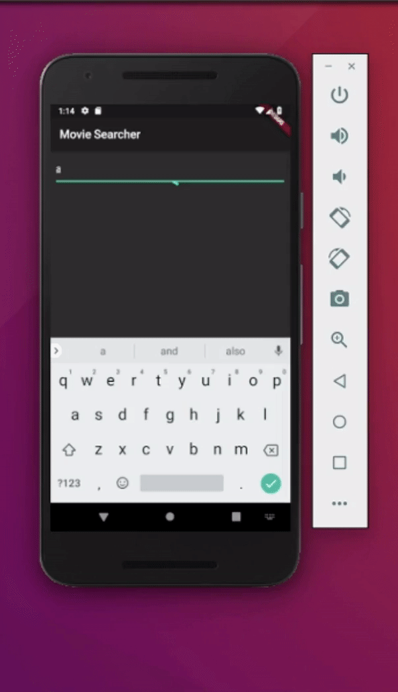

# moovie

Movie Search app I'm building as I'm learning flutter.

The app fetches movie information from [themoviedb API](https://api.themoviedb.org)

# Working function 

- Movie search function.

# To Do 
- After searching display details of movie.
- Add map Info to images 
- Add Movie Ratings 
- There is room to add More stuff and make it more complex.

## Getting Started

For help getting started with Flutter, view our online
[documentation](https://flutter.io/).

# Demo 

